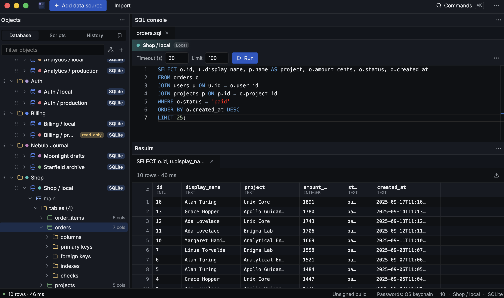
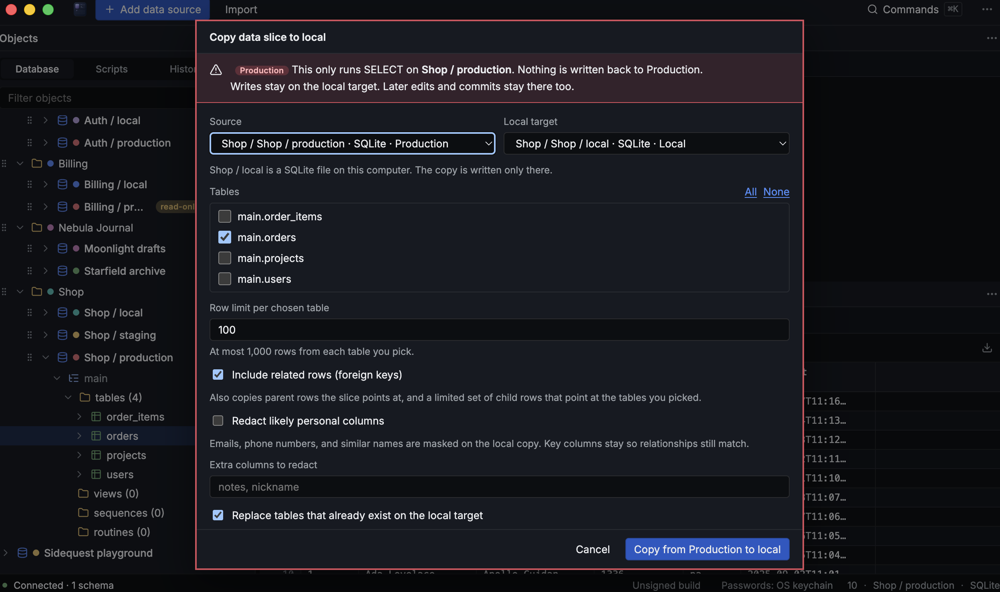
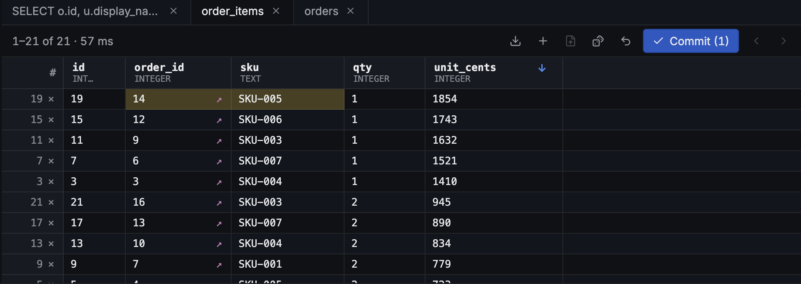
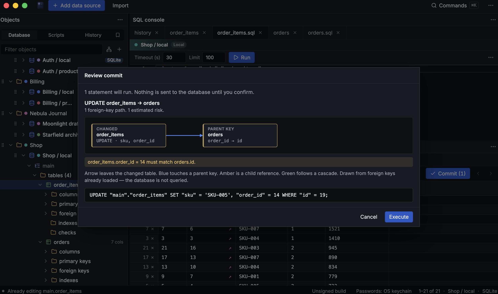
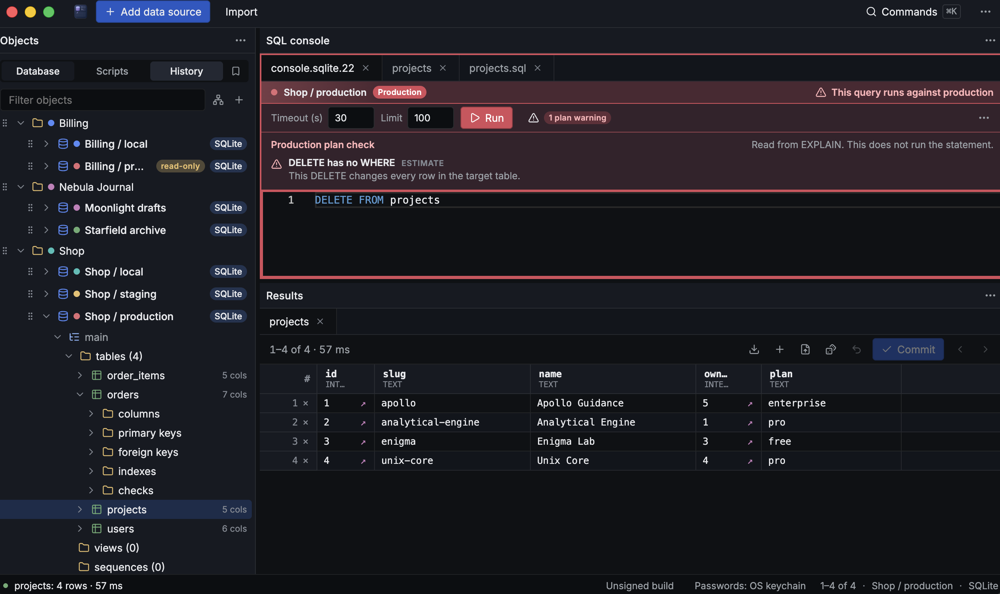
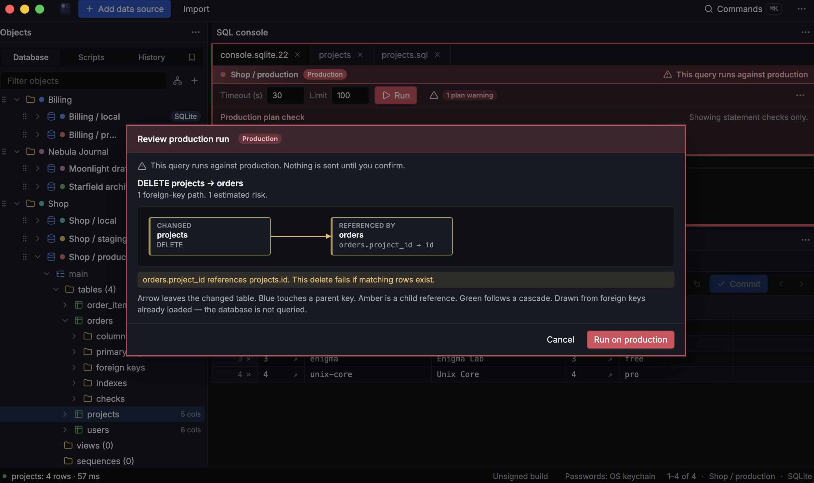
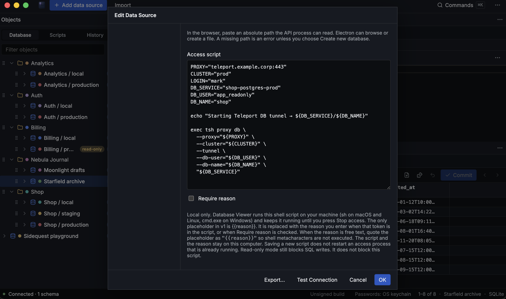

# Database Viewer

A local-first desktop SQL client for people who live in real schemas — folders for microservices, production guards that actually matter, and edits you can review before they land.

*Folders, colors, and environments in the tree. SQL and results in one place — open a table and you’re already querying.*

## Download (macOS)

Grab the latest **unsigned** build from [Releases](https://github.com/MarkKiepe/database-viewer/releases).

> First open from the web: if macOS blocks it, **System Settings → Privacy & Security → Open Anyway**. Expected until we ship signed builds. Windows later.

---

## Prod → local without the full dump

*Slice production into local. Related rows follow foreign keys automatically — not only the table you checked. Production stays read for SELECTs; writes stay on the local target.*

---

## Edit in the grid, Commit when you’re sure

*Change a cell, see it staged, hit **Commit** when the change looks right — no surprise writes.*

*Before anything runs: a review of the statement, foreign-key paths, and estimated risk.*

---

## Production doesn’t get a free pass

*Destructive SQL against production is called out early — plan checks, red chrome, and a clear “this runs against production” banner.*

*Deletes and other risky runs show what’s linked before you break a chain. Confirm only when you mean it.*

---

## Your access gate, not ours

*Wire a local access script once (Teleport, VPN helpers, whatever your team uses). Status and stop stay in the app; the script and reasons stay on your machine.*

---

## And so much more…

Import/export connections as JSON · persisted tree reorder · SQL autocomplete · multi-DB console switcher · generate test data with preview · AI SQL copilot · read-only connections · SSH / TLS options · and more.

---

## Status

Early public builds. Feedback welcome via [Issues](https://github.com/MarkKiepe/database-viewer/issues).

© Mark Kiepe — use at your own risk; provided as-is.
